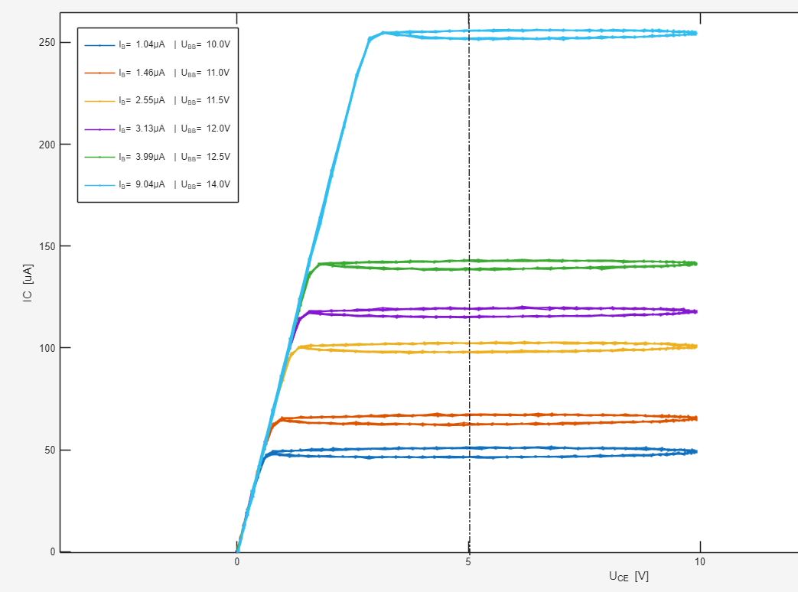

# Oscilloscope's data handling: Bipolar Transistor Laboratory

The following data corresponds to the output characteristics of a transistor that describes the change in the base current related to the collector current. It can be obtained running the program 'A01_FamilyOutputCharacteristic_Transistor'.

## 📌 Family of Output Characteristics

